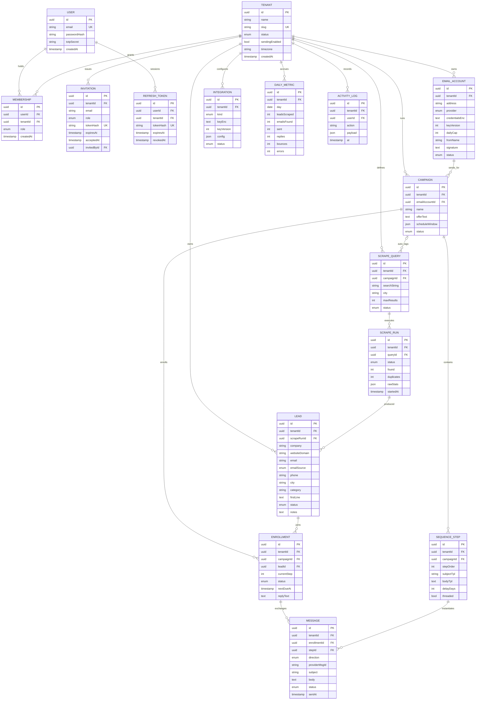

# SignX Reach — Database Design & ERD

PostgreSQL 16 · Prisma ORM · Multi-tenancy: shared database, shared schema, row-level `tenantId` discriminator enforced by a global Prisma extension + NestJS guard.

## 1. ERD (Mermaid)



## 2. Enums

| Enum | Values |
|---|---|
| UserRole | OWNER, ADMIN, MEMBER |
| TenantStatus | ACTIVE, SUSPENDED, DELETED |
| EmailProvider | GMAIL_OAUTH, SMTP |
| AccountStatus | ACTIVE, WARMUP, ERROR, DISABLED |
| IntegrationKind | APIFY, HUNTER, ANTHROPIC, TELEGRAM |
| QueryStatus | PENDING, RUNNING, DONE, FAILED |
| RunStatus | RUNNING, SUCCESS, FAILED |
| LeadStatus | NEW, ENRICHING, READY, UNREACHABLE, DO_NOT_CONTACT, BOUNCED, ARCHIVED |
| EmailSource | APIFY, SCRAPE, HUNTER, IMPORT, MANUAL |
| CampaignStatus | DRAFT, ACTIVE, PAUSED, COMPLETED |
| EnrollmentStatus | QUEUED, ACTIVE, REPLIED, COMPLETED, STOPPED, BOUNCED |
| MessageDirection | OUTBOUND, INBOUND |
| MessageStatus | QUEUED, SENT, FAILED, BOUNCED, RECEIVED |

## 3. Key Constraints & Indexes

- **Denormalized tenantId (standing rule)**: every tenant-scoped child model carries its own `tenantId` column + index even when reachable via a parent — today: SCRAPE_RUN, SEQUENCE_STEP, ENROLLMENT, MESSAGE; applies to every future child model. The tenant-isolation extension scopes these directly, and it mitigates nested-write `connect` escapes.
- `USER`: UNIQUE (email) globally — User is a GLOBAL identity (no tenantId, no role); tenancy and roles live on MEMBERSHIP.
- `MEMBERSHIP`: UNIQUE (userId, tenantId); index (tenantId).
- `INVITATION`: UNIQUE (tokenHash); index (tenantId, email). The invitation's role becomes the membership role on accept.
- `REFRESH_TOKEN`: UNIQUE (tokenHash); index (userId). Tokens are hashed, rotating, bound to the active tenant; all of a user's tokens are revoked on password change.
- `LEAD`: UNIQUE (tenantId, websiteDomain) — the dedupe rule. Index on (tenantId, status).
- `ENROLLMENT`: UNIQUE (leadId, campaignId); index (tenantId); partial index on (status, nextDueAt) WHERE status IN ('QUEUED','ACTIVE') — this is the sender's hot query.
- `MESSAGE`: index on providerMsgId (reply matching); index on (enrollmentId, sentAt); index (tenantId).
- `DAILY_METRIC`: UNIQUE (tenantId, day) — upsert target.
- One active enrollment per lead: partial UNIQUE index on ENROLLMENT(leadId) WHERE status IN ('QUEUED','ACTIVE').
- All FKs ON DELETE: tenant-owned rows CASCADE from TENANT (soft-delete first, purge job later); MESSAGE→ENROLLMENT RESTRICT.

## 4. Prisma Schema (excerpt — core models)

```prisma
model Tenant {
  id             String   @id @default(uuid())
  name           String
  slug           String   @unique
  status         TenantStatus @default(ACTIVE)
  sendingEnabled Boolean  @default(true)
  timezone       String   @default("UTC")
  createdAt      DateTime @default(now())
  memberships    Membership[]
  leads          Lead[]
  campaigns      Campaign[]
}

model User {
  id           String   @id @default(uuid())
  email        String   @unique
  passwordHash String
  totpSecret   String?
  createdAt    DateTime @default(now())
  memberships  Membership[]
}

model Membership {
  id        String   @id @default(uuid())
  userId    String
  user      User     @relation(fields: [userId], references: [id])
  tenantId  String
  tenant    Tenant   @relation(fields: [tenantId], references: [id])
  role      UserRole
  createdAt DateTime @default(now())

  @@unique([userId, tenantId])
  @@index([tenantId])
}

model Lead {
  id            String     @id @default(uuid())
  tenantId      String
  tenant        Tenant     @relation(fields: [tenantId], references: [id])
  scrapeRunId   String?
  company       String
  websiteDomain String
  email         String?
  emailSource   EmailSource?
  phone         String?
  city          String?
  category      String?
  firstLine     String?
  status        LeadStatus @default(NEW)
  notes         String?
  createdAt     DateTime   @default(now())
  updatedAt     DateTime   @updatedAt
  enrollments   Enrollment[]

  @@unique([tenantId, websiteDomain])
  @@index([tenantId, status])
}

model Enrollment {
  id          String   @id @default(uuid())
  tenantId    String   // denormalized from campaign (standing rule, §3)
  campaignId  String
  campaign    Campaign @relation(fields: [campaignId], references: [id])
  leadId      String
  lead        Lead     @relation(fields: [leadId], references: [id])
  currentStep Int      @default(0)
  status      EnrollmentStatus @default(QUEUED)
  nextDueAt   DateTime?
  replyText   String?
  messages    Message[]

  @@unique([leadId, campaignId])
  @@index([tenantId])
  @@index([status, nextDueAt])
}

model Message {
  id            String   @id @default(uuid())
  tenantId      String   // denormalized from enrollment (standing rule, §3)
  enrollmentId  String
  enrollment    Enrollment @relation(fields: [enrollmentId], references: [id])
  stepId        String?
  direction     MessageDirection
  providerMsgId String?
  subject       String?
  body          String?
  status        MessageStatus
  sentAt        DateTime?

  @@index([providerMsgId])
  @@index([tenantId])
}
```

(Full schema follows the ERD 1:1; remaining models are mechanical to derive.)

## 5. Multi-Tenancy Enforcement

1. JWT payload = { userId, tenantId (the ACTIVE workspace), role (for that membership) }; a NestJS guard attaches it to the request context (AsyncLocalStorage). Switching workspaces verifies membership and issues a fresh token pair — scoping always follows the token's active tenant, never the membership list.
2. A Prisma client extension scopes every model that has a `tenantId` field: it injects `where: { tenantId }` into every query and stamps tenantId on create. Special cases: Tenant (scoped by id = ctx.tenantId) and User (GLOBAL identity, not tenant-scoped — tenant access goes through Membership). Denormalized tenantId on child models (§3) closes nested-write gaps. Raw queries are only possible via the unscoped system client and are code-review-gated.
3. Integration keys and email credentials are AES-256-GCM encrypted with a per-environment master key (KMS/env secret); never returned by the API after creation (write-only, show last 4 chars).
4. Automated test suite: for every tenant-scoped endpoint, assert a tenant-B token cannot read/mutate tenant-A rows.

## 6. Data Lifecycle

- Leads ARCHIVED after 90 days cold (cron), purged after 1 year unless DO_NOT_CONTACT (kept forever as suppression list — store only domain+email hash after purge).
- Suppression is strictly PER-TENANT by design (each client workspace keeps its own DO_NOT_CONTACT list); never merge it into a cross-tenant/global list.
- Messages retained 1 year; bodies compressed after 90 days.
- Tenant soft-delete → 30-day grace → hard purge job.
